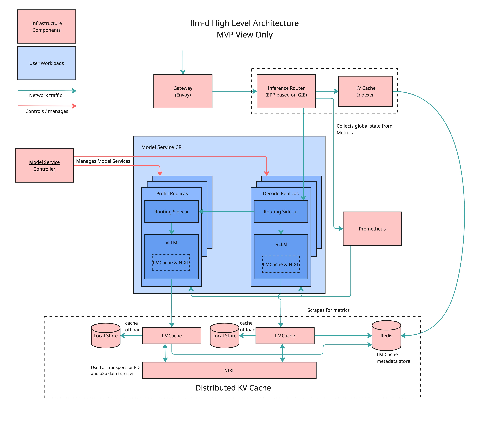

# llm-d Quick Start

Getting Started with llm-d on Kubernetes.

## Overview

This guide will walk you through the steps to install and deploy llm-d on a Kubernetes cluster. llm-d consists of the following components:

- Gateway API Inference Extension (GIE) - This extension upgrades an ext-proc-capable proxy or gateway - such as Envoy Gateway, kGateway, or the GKE Gateway - to become an inference gateway - supporting inference platform teams self-hosting large language models on Kubernetes. This integration makes it easy to expose and control access to your local OpenAI-compatible chat completion endpoints to other workloads on or off cluster, or to integrate your self-hosted models alongside model-as-a-service providers in a higher level AI Gateway like LiteLLM, Solo AI Gateway, or Apigee.

  The inference gateway:
  - Improves the tail latency and throughput of LLM completion requests against Kubernetes-hosted model servers using an extendable request scheduling algorithm that is kv-cache and request cost aware, avoiding evictions or queueing as load increases
  - Provides Kubernetes-native declarative APIs to route client model names to use-case specific LoRA adapters and control incremental rollout of new adapter versions, A/B traffic splitting, and safe blue-green base model and model server upgrades
  - Adds end to end observability around service objective attainment
  - Ensures operational guardrails between different client model names, allowing a platform team to safely serve many different GenAI workloads on the same pool of shared foundation model servers for higher utilization and fewer required accelerators

- Distributed KV Cache
  - LMCache (in llm-d container)
  - NIXL (in llm-d container)
  - KVCache Indexer
  - Redis

- Model Service Controller - ModelService is a Kubernetes operator (CRD + controller) that enables the creation of vllm pods and routing resources for a given model.
  - Enables disaggregated prefill
  - Supports creation of Gateway API Inference Extension resources for routing
  - Supports auto-scaling with HPA
  - Supports independent scaling of prefill and decode instances
  - Supports independent node affinities for prefill and decode instances
  - Supports model loading from OCI images, HuggingFace public and private registries, and PVCs
- Metrics Service (Prometheus)

### Architecture



### Required tools

Following prerequisite are required for the installer to work.

- [yq – installation & releases](https://github.com/mikefarah/yq#install)
- [jq – download & install guide](https://stedolan.github.io/jq/download/)
- [git – installation guide](https://git-scm.com/book/en/v2/Getting-Started-Installing-Git)
- [Helm – quick-start install](https://helm.sh/docs/intro/install/)
- [Kustomize – official install docs](https://kubectl.docs.kubernetes.io/installation/kustomize/)
- [kubectl – install & setup](https://kubernetes.io/docs/tasks/tools/install-kubectl/)

You can use the installer script that installs all the required dependencies.

```bash
./install-deps.sh
```

### Required credentials and configuration

- [llm-d-deployer GitHub repo – clone here](https://github.com/neuralmagic/llm-d-deployer.git)
- [Quay.io Registry – sign-up & credentials](https://quay.io/)
- [Red Hat Registry – terms & access](https://access.redhat.com/registry/)
- [HuggingFace HF_TOKEN](https://huggingface.co/docs/hub/en/security-tokens)

Registry Authentication: The installer looks for an auth file in:

```bash
~/.config/containers/auth.json
# or
~/.config/containers/config.json
```

If not found, you can create one with the following commands:

Create with Docker:

```bash
docker --config ~/.config/containers/ login quay.io
docker --config ~/.config/containers/ login registry.redhat.io
```

Create with Podman:

```bash
podman login quay.io --authfile ~/.config/containers/auth.json
podman login registry.redhat.io --authfile ~/.config/containers/auth.json
```

> ⚠️ You may need to visit Hugging Face [meta-llama/Llama-3.2-3B-Instruct](https://huggingface.co/meta-llama/Llama-3.2-3B-Instruct) and
> accept the usage terms to pull this with your HF token if you have not already done so.

### Target Platform

#### MiniKube

If you planned to deploy local minikube cluster, these dependencies need to be installed.

- [Minikube – getting-started guide](https://minikube.sigs.k8s.io/docs/start/)
- [Podman](https://podman.io/docs/installation) or [Docker](https://docs.docker.com/get-docker/)
- [CUDA Toolkit – downloads & docs](https://developer.nvidia.com/cuda-toolkit)
- [NVIDIA Container Toolkit – install guide](https://docs.nvidia.com/datacenter/cloud-native/container-toolkit/install-guide.html)

For GPU support, see the Minikube documentation as there are a couple of commands that may need to be run [Using NVIDIA GPUs with minikube](https://minikube.sigs.k8s.io/docs/tutorials/nvidia/).

This can be run on a minimum ec2 node type [g6e.12xlarge](https://aws.amazon.com/ec2/instance-types/g6e/) (4xL40S 48GB but only 2 are used by default) to infer the model meta-llama/Llama-3.2-3B-Instruct that will get spun up.

> ⚠️ If your cluster has no available GPUs, the **prefill** and **decode** pods will remain in **Pending** state.

Verify you have properly installed the container toolkit with the runtime of your choice.

```yaml
# Podman
podman run --rm --security-opt=label=disable --device=nvidia.com/gpu=all ubuntu nvidia-smi
        # Docker
sudo docker run --rm --runtime=nvidia --gpus all ubuntu nvidia-smi
```

To Provision a Minikube cluster run the `llmd-installer-minikube.sh` script.

```bash
./llmd-installer-minikube.sh --provision-minikube-gpu
```

## llm-d Installation

The llm-d-deployer contains all the helm charts necessary to deploy llm-d. To facilitate the installation of the helm charts, the `llmd-installer-minikube.sh` script is provided. This script will populate the necessary manifests in the `manifests` directory. After this, it will apply all the manifests in order to bring up the cluster.

Before proceeding with the installation, ensure you have installed the required dependencies

### Usage

The installer needs to be run from the `llm-d-deployer/quickstart` directory.

```bash
./llmd-installer-minikube.sh [OPTIONS]
```

### Flags

| Flag                       | Description                                                                                             | Example                                                   |
|----------------------------|---------------------------------------------------------------------------------------------------------|-----------------------------------------------------------|
| `--hf-token TOKEN`         | HuggingFace API token (or set `HF_TOKEN` env var)                                                       | `./llmd-installer-minikube.sh --hf-token "abc123"`                        |
| `--auth-file PATH`         | Path to your registry auth file ig not in one of the two listed files in the auth section of the readme | `./llmd-installer-minikube.sh --auth-file ~/.config/containers/auth.json` |
| `--provision-minikube`     | Provision a local Minikube cluster without GPU support (implies `--minikube-storage`)                   | `./llmd-installer-minikube.sh --provision-minikube`                       |
| `--provision-minikube-gpu` | Provision a local Minikube cluster with GPU support (implies `--minikube-storage`)                      | `./llmd-installer-minikube.sh --provision-minikube`                       |
| `--minikube-storage`       | Use the Minikube-specific PVC manifest for storage                                                      | `./llmd-installer-minikube.sh --minikube-storage`                         |
| `--storage-size SIZE`      | Size of storage volume (default: 7Gi)                                                                   | `./llmd-installer-minikube.sh --storage-size 15Gi`                        |
| `--storage-class CLASS`    | Storage class to use (default: efs-sc)                                                                  | `./llmd-installer-minikube.sh --storage-class ocs-storagecluster-cephfs`  |
| `--delete-minikube`        | Delete local Minikube cluster                                                                           | `./llmd-installer-minikube.sh --delete-minikube`                          |
| `--namespace NAME`         | Kubernetes namespace to use (default: `llm-d`)                                                          | `./llmd-installer-minikube.sh --namespace foo`                            |
| `--values NAME`            | Absolute path to a Helm values.yaml file (default: llm-d-deployer/charts/llm-d/values.yaml)             | `./llmd-installer-minikube.sh --values /path/to/values.yaml`              |
| `--uninstall`              | Uninstall llm-d and cleanup resources                                                                   | `./llmd-installer-minikube.sh --uninstall`                                |
| `-h`, `--help`             | Show help and exit                                                                                      | `./llmd-installer-minikube.sh --help`                                     |

## Examples

If you want to run Minikube with GPU support see [Using NVIDIA GPUs with minikube](https://minikube.sigs.k8s.io/docs/tutorials/nvidia/).

```yaml
minikube start --driver docker --container-runtime docker --gpus all --gpus all --nodes=3
```

### Provision Minikube cluster without GPU support and install llm-d

**note**: prefill/decode pods will stay in pending status since there is no GPU node to schedule on.

```bash
export HF_TOKEN="your-token"
./llmd-installer-minikube.sh --provision-minikube --hf-token "$HF_TOKEN"
```

### Provision Minikube cluster with GPU support and install llm-d

```bash
export HF_TOKEN="your-token"
./llmd-installer-minikube.sh --provision-minikube-gpu --hf-token "$HF_TOKEN"
```

### Use Minikube storage if the minikube cluster is already provisioned to install llm-d

```bash
export HF_TOKEN="your-token"
./llmd-installer-minikube.sh --minikube-storage --hf-token "$HF_TOKEN"
```

## Model Service

### Customizing the ModelService

The ModelService looks like:

```yaml
kind: ModelService
metadata:
spec:
```

### Creating a New Model Service

To create a new model service, you can edit the ModelService custom resource for your needs. Examples have been included.

```bash
kubectl apply -f modelservice.yaml
```

### Validation

For GPU-enabled clusters (including Minikube), you can quickly verify the setup. Once both the prefill and
decode pods are running and ready, simply send a curl request to the decode endpoint to confirm that chat
completions are working.

```bash
NAMESPACE=llm-d
POD=$(kubectl get pods -n "$NAMESPACE" -l llm-d.ai/role=decode -o jsonpath='{.items[0].metadata.name}')
kubectl exec -n "$NAMESPACE" -c vllm "$POD" -- \
  curl -sS -X POST http://localhost:8000/v1/chat/completions \
    -H 'accept: application/json' \
    -H 'Content-Type: application/json' \
    -d '{
      "model": "Llama-32-3B-Instruct",
      "messages": [{"role":"user","content":"Who won the World Series in 1986?"}],
      "stream": false
    }'
```

After the p/d pods are running, you can view the models being run on the GPUs on the host to verify activity.

```yaml
nvidia-smi --query-gpu=index,name,utilization.gpu,utilization.memory,memory.used,memory.total --format=csv
```

### Troubleshooting

The various images can take some time to download depending on your connectivity. Watching events
and logs of the prefill and decode pods is a good place to start.

### Uninstall

This will remove llm-d resources from the cluster. This is useful, especially for test/dev if you want to
make a change, simply uninstall and then run the installer again with any changes you make.

```bash
./llmd-installer-minikube.sh --uninstall
```

To remove the minikube cluster this simply wraps the minikube command for convenience.

```bash
./llmd-installer.sh --delete-minikube
```
